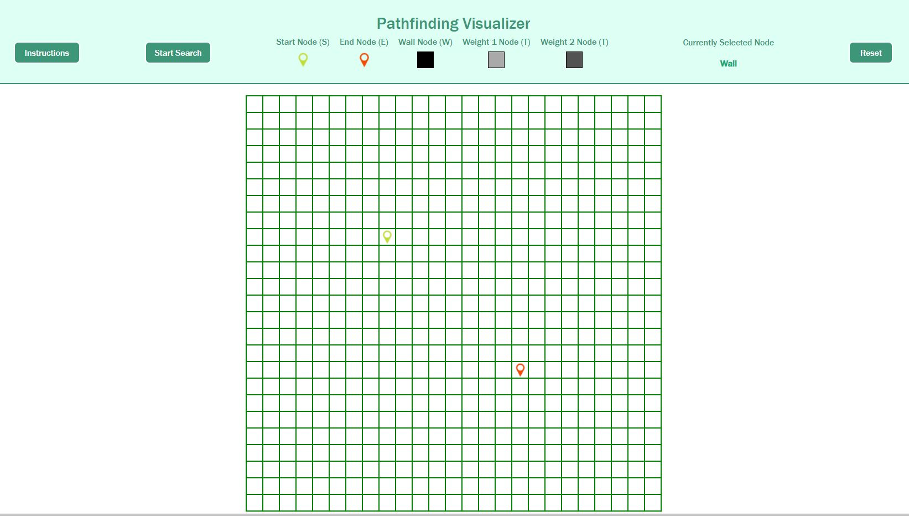

# Pathfinder

[Live Site Link](https://leech92.github.io/Pathfinder)



# Overview
Pathfinder is a pathfinding visualizer that uses search algorithms to find the shortest path from the start point to the end point. When the search function is run the application will first show you how it is looking for the end point. Once the end point is found the application will show you the shortest path to get from the start point to the end point.

# Technologies
Pathfinder is built using The Create React App to create a dynamic grid that allows for a more seamless user experience.

# Functionality and MVPs
With Pathfinder, users will be able to:

- Start a search algorithm that will visually show the user how the algorithm finds the end point and returns the shortest path
- Move the start point and end point to any tile on the grid
- Create wall tiles that can block the search algorithm from moving to certain tiles
- Create multiple level weighted tiles that will require the search algorithm to take additional "turns" to move onto.

# Features
## Dijkstras Algorithm

Pathfinder uses dijkstra's algorithm to find the shortest path from the start point to the end point. Dijkstra's algorithm is a variation of BFS that allows for the use of a weighted graph. A path with a weighted edge would increase the distance of the path and requires the queue to order the queue based on the least weighted path.

```js
export function dijkstras(grid, start, end) {
    if (!start || !end || start === end) {
        return false
    }

    start.distance = 0
    const newNodes = []
    for (const row of grid) {
        for (const node of row) {
            newNodes.push(node)
        }
    }
    const visitedNodes = []

    while (newNodes.length) {
        sortNodes(newNodes)
        let currNode = newNodes.shift()
        if (currNode.wall) continue
        if (currNode.distance === Infinity) return visitedNodes
        currNode.visited = true
        if (currNode.weight === 0) {
            visitedNodes.push(currNode)
        }else {
            currNode.weight= currNode.weight - 1
            currNode.distance = currNode.distance + 1
            newNodes.push(currNode)
        }
        if (currNode === end) return visitedNodes
        updateNextNodes(currNode, grid)
    }
}

function sortNodes(newNodes) {
    newNodes.sort((node1, node2) => {
        return(node1.distance - node2.distance)
    })
}

function updateNextNodes(node, grid) {
    const nextNodes = getNextNodes(node, grid)
    for (const nextNode of nextNodes) {
        nextNode.distance = node.distance + 1
        nextNode.previous = node
    }
}

function getNextNodes(node, grid) {
    const nextNodes = []
    const { col, row } = node
    if (row > 0) nextNodes.push(grid[row - 1][col])
    if (row < grid.length - 1) nextNodes.push(grid[row + 1][col])
    if (col > 0) nextNodes.push(grid[row][col - 1])
    if (col < grid[0].length - 1) nextNodes.push(grid[row][col + 1])

    return nextNodes.filter(nextNode => !nextNode.visited)
}

export function getShortestPath(end) {
    const shortestPath = []
    let currNode = end
    while (currNode !== null) {
        shortestPath.unshift(currNode)
        currNode = currNode.previous
    }
    return shortestPath
}
```

## Update Grid

Pathfinder has a grid that allows for user input to move the start point and end point. The user is also able to create wall tiles and weighted tiles. This was done using the keys to toggle which action the user wants to control and the mouse to select tiles.

```js
componentDidMount() {
    const grid = createGrid()
    this.setState({grid})
    document.body.addEventListener('keydown', (e) => {
        if (e.key === 'w' || e.key === 't' || e.key === 's' || e.key === 'e') {
            this.setState({wallActive: false})
            this.setState({weightActive: false})
            this.setState({startActive: false})
            this.setState({endActive: false})
        }
        if (e.key === 'w') this.setState({wallActive: true})
        if (e.key === 't') this.setState({weightActive: true})
        if (e.key === 's') this.setState({startActive: true})
        if (e.key === 'e') this.setState({endActive: true})
    })
}

const updateGrid = (grid, row, col, type) => {
    const updatedGrid = grid
    const node = updatedGrid[row][col]
    if (!node.start && !node.end && !node.wall) {
        if (type === "wall" && node.weight === 0) {
            const updatedNode = updateWall(node)
            updatedGrid[row][col] = updatedNode
            return updatedGrid
        }else if (type === "weight") {
            const updatedNode = updateWeight(node)
            updatedGrid[row][col] = updatedNode
            return updatedGrid
        }else if (type === "start") {
            updatedGrid[startRow][startCol].start = false
            startRow = row
            startCol = col
            const updatedNode = updateStart(node)
            updatedGrid[row][col] = updatedNode
            return updatedGrid
        }else if (type === "end") {
            updatedGrid[endRow][endCol].end = false
            endRow = row
            endCol = col
            const updatedNode = updateEnd(node)
            updatedGrid[row][col] = updatedNode
            return updatedGrid
        }else {
            return updatedGrid
        }
    }else {
        return updatedGrid
    }
}

const updateWall = node => {
    return {
        ...node,
        wall: !node.wall
    } 
}

const updateWeight = node => {
    if (node.weight === 2) {
        return {
            ...node,
            weight: 0
        }
    }else {
        return {
            ...node,
            weight: node.weight + 1
        }
    }
}

const updateStart = node => {
    return {
        ...node,
        start: true
    }
}

const updateEnd = node => {
    return {
        ...node,
        end: true
    }
} 
```